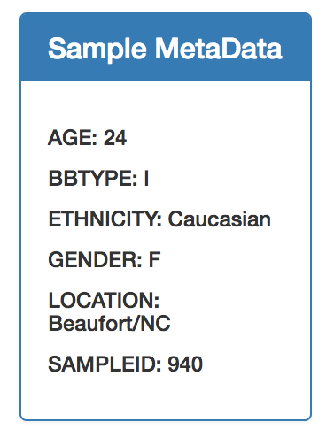

# Plotly
Plotly Dashboard hosted on Heroku

This project explores the biodiversity found in microbes living in the belly button.  
Data was extracted from SQLlite databases and posted on a Flask API.
Plotly and D3 were then used to create an interactive dashboard of the data.

You can choose from a list of patient samples.

Information about the patient appears in the metadata table

A pie chart shows the different types of microbes within the given sample and their size as a percent of total microbes.  
Hover over each slice to get additional information.

A bubble chart shows the absolute sizes of each type of microbe found in the given sample.
Hover over each bubble to get additional information.
